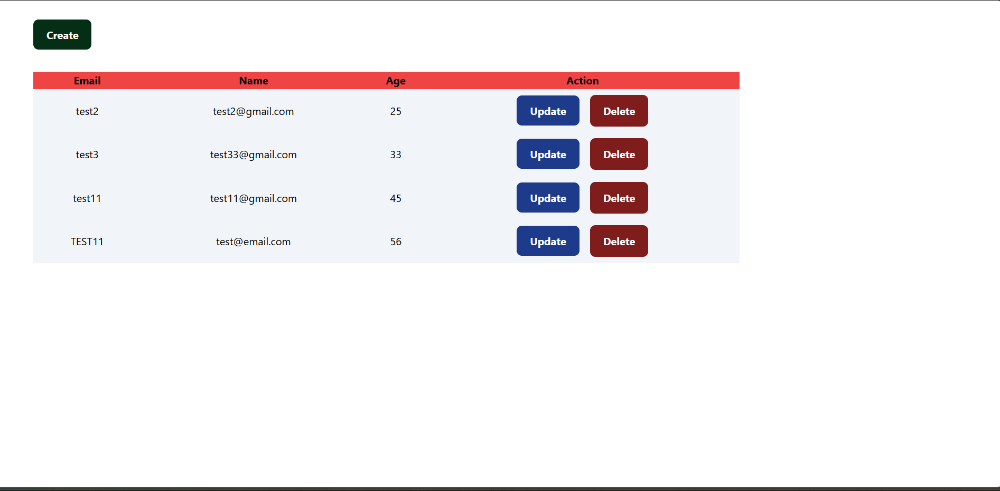
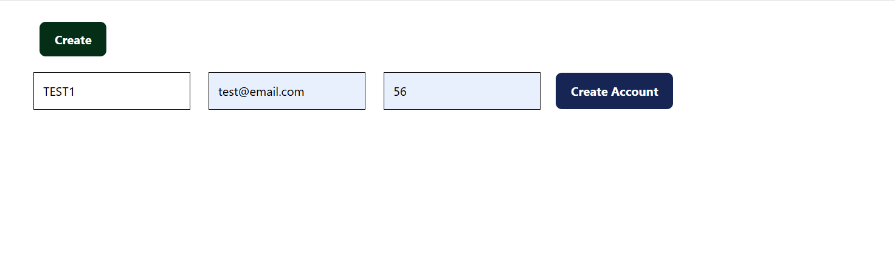
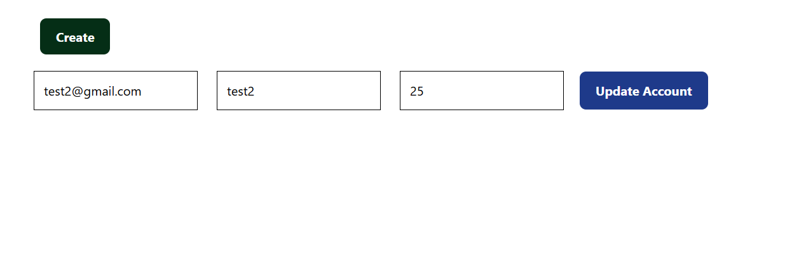

# 🌐 MERN Stack CRUD Application

A full-stack **CRUD (Create, Read, Update, Delete)** web application built using the powerful **MERN stack**:

- 🛢 **MongoDB** – NoSQL Database
- ⚙️ **Express.js** – Backend Framework
- ⚛️ **React.js** – Frontend Library
- 🟢 **Node.js** – JavaScript Runtime

Styled with **Tailwind CSS** and tested with **Insomnia** for seamless API integration.

---

## 📸 Screenshots

> 💡 Make sure to place your images in the `/screenshots` folder for correct rendering on GitHub.

### 🏠 Home Page

### 📝 Create User

### 🔄 Update User

---

## 🚀 Features

- ➕ Create new users
- 📄 View a list of all users
- ✏️ Update existing user data
- ❌ Delete users
- 🎨 Responsive UI with Tailwind CSS
- 🔌 RESTful API tested via Insomnia

---

## 🛠️ Tech Stack

### 🖥️ Frontend
- React
- Tailwind CSS
- Axios

### 🗄️ Backend
- Node.js
- Express.js
- MongoDB
- Mongoose

### 🧪 API Testing
- Insomnia

---

